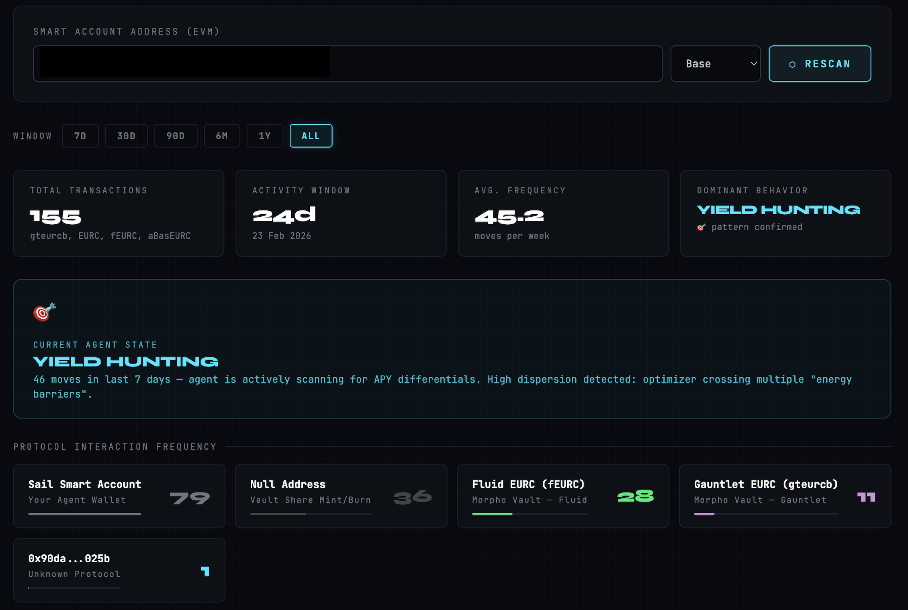
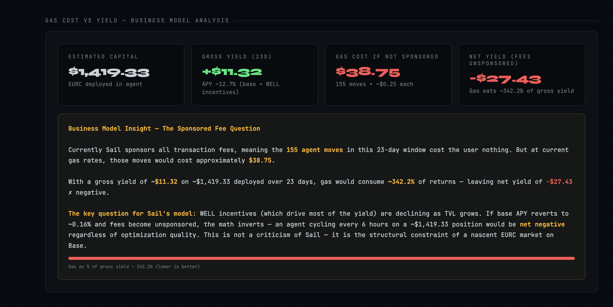
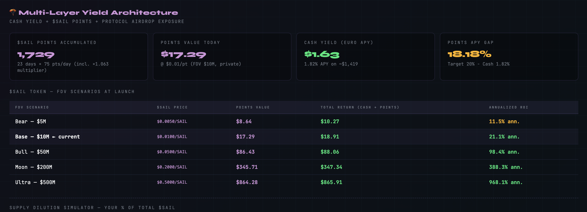

# ⚓ Sail Agent — Behavioral Forensics

> On-chain movement analysis tool for [Sail Money](https://sail.money) AI yield agent

**[🔗 Live Tool](https://alex-lamport.github.io/sail-forensics/)**

Built by [@alex_lamports](https://x.com/alex_lamports) — 23 days of on-chain forensics on an AI yield agent.

---

## What it does

Paste any Sail smart account address (EVM) and get:

- **Transaction Timeline** — every token transfer classified as Inflow / Outflow / Burst Move
- **Protocol Interaction Frequency** — which vaults the agent actually uses
- **Behavioral State Detection** — Yield Hunting / Rebalancing / Consolidation / Deep Stasis
- **Gas Cost vs Yield Analysis** — what the position costs if fees stop being sponsored
- **Capital Distribution Over Time** — moves per day per vault with Phase 1/2 annotations
- **$SAIL Points Calculator** — accumulated points, FDV scenarios at launch
- **Supply Dilution Simulator** — your % of total $SAIL with interactive sliders

---

## Screenshots

### Overview — Protocol Frequency & Transaction Timeline

### Gas Cost vs Yield — Business Model Analysis

### Multi-Layer Yield — $SAIL Points & FDV Scenarios

---

## Key findings (23 days, €1,452 deployed)

| Metric | Value |
|--------|-------|
| Total transactions | 155 |
| Real protocols used | 2 (Fluid EURC + Gauntlet EURC) |
| Cash yield | €0.61 (1.82% APY) |
| Points accumulated | 1,729 $SAIL |
| Gas cost if unsponsored | $38.75 |
| Net yield without sponsorship | **-$27.43** |

## How to use

1. Open the [live tool](https://alex-lamport.github.io/sail-forensics/)
2. Paste your Sail smart account address
3. *(Optional)* Enter a free Basescan API key for real-time data
4. Select time window (7D / 30D / 90D / ALL)
5. Click SCAN

## Data sources

| Source | Speed | Setup |
|--------|-------|-------|
| [Blockscout](https://base.blockscout.com) | ~5h delay | No key needed (default) |
| [Basescan](https://basescan.org) | Real-time | Free API key from [basescan.org/myapikey](https://basescan.org/myapikey) |

> **Note:** Blockscout is used by default — no API key required. For real-time data add a free Basescan API key in the optional field.

## Stack

Vanilla HTML/CSS/JS — single file. Chart.js + chartjs-plugin-annotation. Blockscout API v2 + Basescan API.

## Disclaimer

Independent research tool. Not affiliated with Sail Money.

---

*Part of the [Fortress Architecture](https://github.com/alex-lamport/fortezza)*
